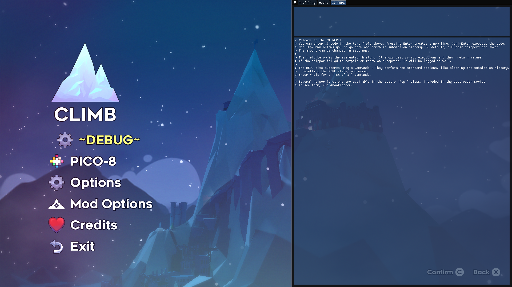
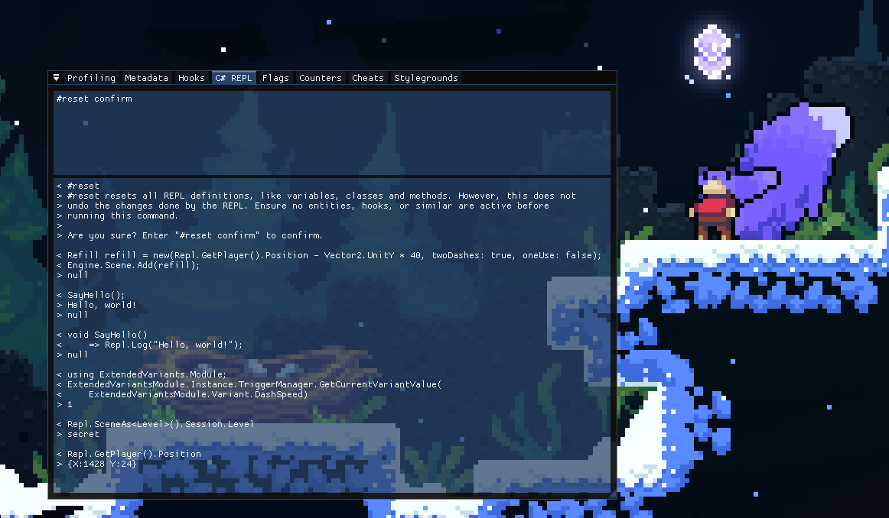

# CelesteREPL

A Celeste mod which allows you to evaluate C# in the context of Celeste in real-time.

This mod behaves like an addon to [Mapping Utils](https://gamebanana.com/mods/454074),
which means that that mod needs to be installed to use CelesteREPL.

## Building

To build, you first need to install [Mapping Utils](https://gamebanana.com/mods/454074)
and run the game with them at least once.
Then, copy over the following files to the `bin` folder from the NuGet cache:
- `Microsoft.CodeAnalysis.CSharp.dll` (and `.pdb`)
- `Microsoft.CodeAnalysis.CSharp.Scripting.dll` (and `.pdb`)
- `Microsoft.CodeAnalysis.dll` (and `.pdb`)
- `Microsoft.CodeAnalysis.Scripting.dll` (and `.pdb`)
- `Microsoft.CSharp.dll`

Now you are ready to build.
